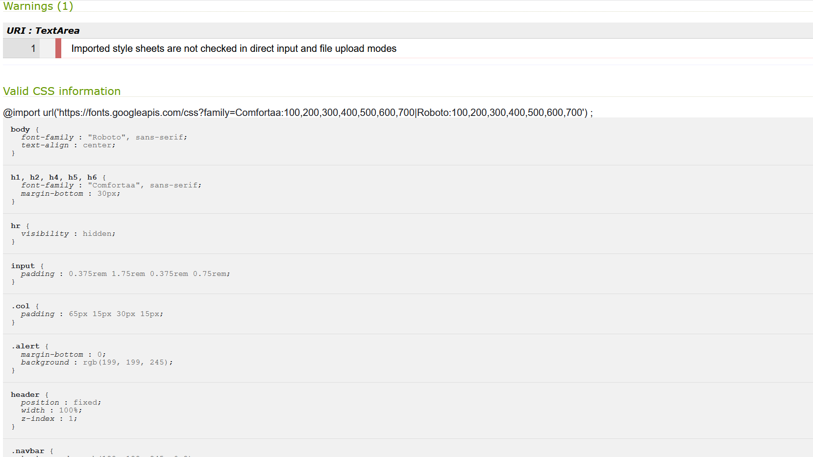

<h1 align="center">MS1 (Shashin)</h1>

[Go to the project here.](https://lonneke-dev.github.io/ms1/)

This project is an assignment of the Full stack development course I am following at CodeInstitute to show my skills with HTML5 and CSS3 so far. 

<h4 align="left"></h4> 

Shashin is meant for people that are interested in photography and in this case mine specifically. They might have seen some of my work somewhere 
else online and now want to have some of it for themselves. So by making this website I give the users the ability to get a print out for themselves and to get 
to know me and my work even more.

## User Experience (UX)

-   ### User stories

    -   #### First Time Visitor Goals

        1. As a First Time Visitor, I want to easily understand the main purpose of the site.
        2. As a First Time Visitor, I want to be able to easily navigate throughout the site to find content.
        3. As a First Time Visitor, I want to know more about the person behind the project (photograph's) so that I know the origin and if it's trustworthy.
        4. As a First Time Visitor, I want to be able to see the content of the photograph section on a bigger scale. 

    -   #### Returning Visitor Goals

        1. As a Returning Visitor, I want to find more photographs and potentially purchase something.
        2. As a Returning Visitor, I want to find the best way to get in to contact so I could ask questions and get more information.

    -   #### Frequent User Goals
        1. As a Frequent User, I want to check to see if there are any newly added photos or products.
        2. As a Frequent User, I want to know what happens with the information I grant this website and if it is safe.
        3. As a Frequent User, I want to know if there's anything new and if there are any discounts.

-   ### Design
    -   #### Colour Scheme
        -   The main colours used in this project are different shades of purple (rgb(199, 199, 245) & rgb(131, 131, 246)) to make sure it doesn't interfere with the many photographs presented on the website.
    -   #### Typography
        -   The Comfortaa font is used throughout the whole website for headings and the cover text to give a smooth but informal look to the website. 
        -   The Roboto font is used throughout the whole website for all the paragraphs because it's a common used font. So it's easy to read for the users.
        -   The Sans Serif fotn is the fallback font in case for any reason the font isn't being imported into the site correctly. 
    -   #### Imagery
        -   The Imagery is very important, especially on this website. So I went with a calm but still eyecatching hero-image to introduce the users 
            to the sort of images they can expect throughout the website.

*   ### Wireframes

    -   [See all Wireframes here](assets/mockups/mockups-ms1.pdf)

    -   All wireframes were made with [Balsamiq](https://balsamiq.com/)

## Features

-   All features are responsive on all device sizes

    -   Navigation/menu bar 
        * Allows users to go to certain parts of the website easily by clicking on the specific section in the navbar.
    -   Alert/sale bar 
        * Allows users to know if certain deals or discounts are going on so that they are more willing to buy something at that specific moment.
    -   Social media links 
        * Allows users to go to the person's social media platforms so that they can see more and/or come into contact, by clicking on the links in the footer or the instagram post in the contact section.
    -   Privacy policy 
        * Allows users to know what happens with the information they fill in so that they know it's save to do so, by clicking on the privacy policy which opens up a separate page.
    -   Message form 
        * Allows users to come into direct contact with me, by filling out the form.
    -   Purchase form 
        * Allows users to purchase photographs that they liked, by selecting the photo and size. Additionally they have to fill out their pesonal information.
    -   About section 
        * Allows users to get more information about the person and equipment behind the photos, by reading the about section. 

-   Interactive elements

    -   The headings and navbar links are all made interactive with [Hover.css](https://ianlunn.github.io/Hover/) for playfull design and UX purposes. 
    -   The photographs in the photograph section, the social media links in the footer and the privacy policy link in the purchase section all have a hover over style for users to make clear they're clickable.
    -   In the purchase section there are two dropdown menus for the users to easily choose the right option.
    -   All buttons on the site have a hover over style aswell to make clear they are clickable.

## Future Features

-   An interactive registering purchase section that saves what the users fill out and gives the users the option to select more than 1 photo.

-   A modal on the photos to open a bigger size within the page itself.

-   A working message form that registers what the users fill and sends it automatically to my email.

-   The possibility to pay on the site itself.

-   A live instagram post in the contact section.

## Technologies Used

### Languages Used

-   [HTML5:](https://en.wikipedia.org/wiki/HTML5) Used to structurize and design the layout and content of the website.
-   [CSS3:](https://en.wikipedia.org/wiki/Cascading_Style_Sheets) Used to style the website and create some of the responsiveness and interactive elements.

### Frameworks, Libraries & Programs Used

1. [Bootstrap 4.5.0:](https://getbootstrap.com/docs/4.5/getting-started/introduction/)
    - Bootstrap was used to help with the layout and responsiveness of the website, it was also used to make the navbar and alertbar.
1. [Hover.css:](https://ianlunn.github.io/Hover/)
    - Hover.css was used for the navbar to make clear they're clickable and the heading of the sections to make interactive design. 
1. [Google Fonts:](https://fonts.google.com/)
    - Google fonts were used to import the 'Comfortaa and Roboto' fonts into the style.css file which is used throughout the project.
1. [Font Awesome:](https://fontawesome.com/)
    - Font Awesome was used to add icons to the navbar and footer for aesthetic and UX purposes.
1. [Git](https://git-scm.com/)
    - Git was used for version control by utilizing the Gitpod terminal to commit to Git and Push to GitHub.
1. [GitHub:](https://github.com/)
    - GitHub is used to store the projects code after being pushed from Git.
1. [Balsamiq:](https://balsamiq.com/)
    - Balsamiq was used to create the [wireframes](assets/mockups/mockups-ms1.pdf) during the design process.
1. [cdnjs:](https://cdnjs.com/)
    - cdnjs was used to find the right cdn for Hover.css

## Testing

The W3C Markup Validator and W3C CSS Validator Services were used to validate every page of the project to ensure there were no syntax errors in the project.

-   [W3C Markup Validator](https://validator.w3.org/#validate_by_input)
    
    - The validation of the index page:
<hr>
    
<hr>
    - The validation of the privacy page:
<hr>
    
<hr>
-   [W3C CSS Validator](https://jigsaw.w3.org/css-validator/#validate_by_input) 
    
    - The validation of the css file.
<hr>
    
    

### Testing User Stories

-   #### First Time Visitor Goals

    1. As a First Time Visitor, I want to easily understand the main purpose of the site.

        1. When users enter the site, they are greeted with an easily readable navigation bar to go to any section on the page together with a removeable alertbar to inform them about discounts, which sticks to the top of the page for easy access. 
        2. The users will immediately see the hero image to give a peek of what will be up ahead. 
        3. Underneath the hero image there's an introduction text for the users to understand the main purpose and focus on the website.

    2. As a First Time Visitor, I want to be able to easily be able to navigate throughout the site to find content.

        1. The site has a one page design to make it easy for the users. At the top of the page there is a navigation bar that sticks there throughout the whole page, each link describes where they will end up on the page clearly.
        2. There's one separate page which you can go to through the link called; privacy policy which opens in a separate tab. That page has also his own fixed navigation bar to easily return to the main page.

    3. As a First Time Visitor, I want to know more about the person behind the project (photograph's) so that I know the origin and if it's trustworthy.
        
        1. When the users go to the about me section by scrolling down or using the link in the navbar the users can get more information about the creater and what is used to make the content. 
        2. The users could go to the contact section to get direct information by leaving me a message or sending me an email described underneath the message form.
        3. The users could also go to the bottom of the page to find social media links both in the contact section and footer.

    4. As a First Time Visitor, I want to be able to see the content of the photograph section on a bigger scale. 
    
        1. By having the photos slightly change when you hover over them it makes it clear to the users that they are clickable.
        2. When the users click on the photos the photo opens in a separate page filling up the whole screen.

-   #### Returning Visitor Goals

    1. As a Returning Visitor, I want to find more photographs and potentially purchase something.

        1. Updates on products and new content will be mentioned in the introduction section. 
        2. In the purchase section the users can select and buy products by filling in the form.
        3. More content can also be found by checking out the social media links.

    2. As a Returning Visitor, I want to find the best way to get in to contact so I could ask questions and get more information.

        1. The users can easily go the contact section by using the contact link in the navbar.
        2. Here they can fill out the form to send a direct message or they can send me an email stated underneath the form.
        3. Next to the form the users can also see a preview of my instagram account which they can click on aswell, it will open a separate page and show the post.
        4. The footer contains social media links leading to my own accounts on facebook instagram and more.
        5. Whichever link they click, it will be open up in a new tab to ensure the user can easily get back to the website.

-   #### Frequent User Goals

    1. As a Frequent User, I want to check to see if there are any newly added photos or products.

        1. In the introduction section there will be updates on new photos, options and more.

    2. As a Frequent User, I want to know what happens with the information I grant this website and if it is safe.

        1. The users can read the full privacy policy at the purchase section, which they have to agree with to continue.

    3. As a Frequent User, I want to know if there's anything new and if there are any discounts.

        1. The introduction page will hold the updates and new items.
        2. The alertbar at the top of the page will inform the users on current discounts.

### Further Testing

-   The Website was tested on multiple browsers and a variety of devices;
    
-   A large amount of testing was done on responsiveness and functionality.

### Known Bugs

-   In some browsers the vertical images show horizontally unless they are opened in a separate tab by clicking on them.

-   Navbar collapsed didn't show the background correctly : By changing the height of the navbar back to normal it showed the background correctly again.
-   On chrome when decreasing the screen size you could move the website horizontally : By getting rid of the live instagram post and making all margins and padding throughout the website the same the problem was fixed.
-   The equipment image in the about section didn't align nicely with the bottom : by giving the image extra top padding on a large screen size the image was nicely aligned.
-   Gaps in the about section on smaller screen sizes : I created a mediaquery to decide the padding on a bigger screensize so the smaller screensizes have minimum padding.

## Deployment

### GitHub Pages

The project was deployed to GitHub Pages using the following steps...

1. Log in to GitHub and locate the [GitHub Repository](https://github.com/)
2. At the top of the Repository (not top of page), locate the "Settings" Button on the menu.
    - Alternatively Click [Here](https://raw.githubusercontent.com/) for a GIF demonstrating the process starting from Step 2.
3. Scroll down the Settings page until you locate the "GitHub Pages" Section.
4. Under "Source", click the dropdown called "None" and select "Master Branch".
5. The page will automatically refresh.
6. Scroll back down through the page to locate the now published site [link](https://github.com) in the "GitHub Pages" section.

### Forking the GitHub Repository

By forking the GitHub Repository we make a copy of the original repository on our GitHub account to view and/or make changes without affecting the original repository by using the following steps...

1. Log in to GitHub and locate the [GitHub Repository](https://github.com/)
2. At the top of the Repository (not top of page) just above the "Settings" Button on the menu, locate the "Fork" Button.
3. You should now have a copy of the original repository in your GitHub account.

### Making a Local Clone

1. Log in to GitHub and locate the [GitHub Repository](https://github.com/)
2. Under the repository name, click "Clone or download".
3. To clone the repository using HTTPS, under "Clone with HTTPS", copy the link.
4. Open Git Bash
5. Change the current working directory to the location where you want the cloned directory to be made.
6. Type `git clone`, and then paste the URL you copied in Step 3.

```
$ git clone https://github.com/lonneke-dev/ms1
```

7. Press Enter. Your local clone will be created.

```
$ git clone https://github.com/lonneke-dev/ms1
> Cloning into `CI-Clone`...
> remote: Counting objects: 10, done.
> remote: Compressing objects: 100% (8/8), done.
> remove: Total 10 (delta 1), reused 10 (delta 1)
> Unpacking objects: 100% (10/10), done.
```

Click [Here](https://help.github.com/en/github/creating-cloning-and-archiving-repositories/cloning-a-repository#cloning-a-repository-to-github-desktop) to retrieve pictures for some of the buttons and more detailed explanations of the above process.

## Credits

### Code

-   [Codeinstitute](https://codeinstitute.net/): For teaching me the basics and making it possible to do this project.

-   [Fontawesome](https://fontawesome.com/): Used for the icons in the navbar and the social media links in the footer.

-   [Hover.CSS](https://ianlunn.github.io/Hover/): Used for the navbar and the heading of the sections to make interactive design. 
    To find the cdn of hover.css I used [cdnjs](https://cdnjs.com/).

-   [Bootstrap4](https://getbootstrap.com/docs/4.4/getting-started/introduction/): Bootstrap Library used throughout the project mainly to make site responsive using the Bootstrap Grid System.

-   [W3schools](https://www.w3schools.com/): Used to help with finding the right names and attributes.

### Content

-   The cover-text on the hero image is a quote written by "Peter James".

-   The content of the privacy policy is made through [websitepolicyies](https://www.websitepolicies.com/?utm_source=newsletter&utm_medium=email&utm_campaign=new-user&utm_content=welcome&utm_term=websitepolicies.com) for the privacy policy 

-   All other content is written by the developer (me).

### Media

-   The instagram-post image in the contact section is a screenshot made in the instagram app from my account, which can be found [here](https://www.instagram.com/p/B7X_FUIFR2T/?hl=nl)

-   All other images used on this website are obtained from my own personal library.

### Acknowledgements

-   My Mentor for giving me feedback and support.

-   Tutor support at [Code Institute](https://codeinstitute.net/) for their helpful tips and tricks and keeping me motivated all the way through.

-   The code institute [slack](https://slack.com/intl/en-nl/) community for helping me out with problems like finding the right bootstrap command and layout ideas.

-   My parents for listening to me while I rambled on about fixing problems and trying to explain what I was actually doing to understand what I was doing myself.

-   My friends for supporting me and showing excitement when I figured something out again.