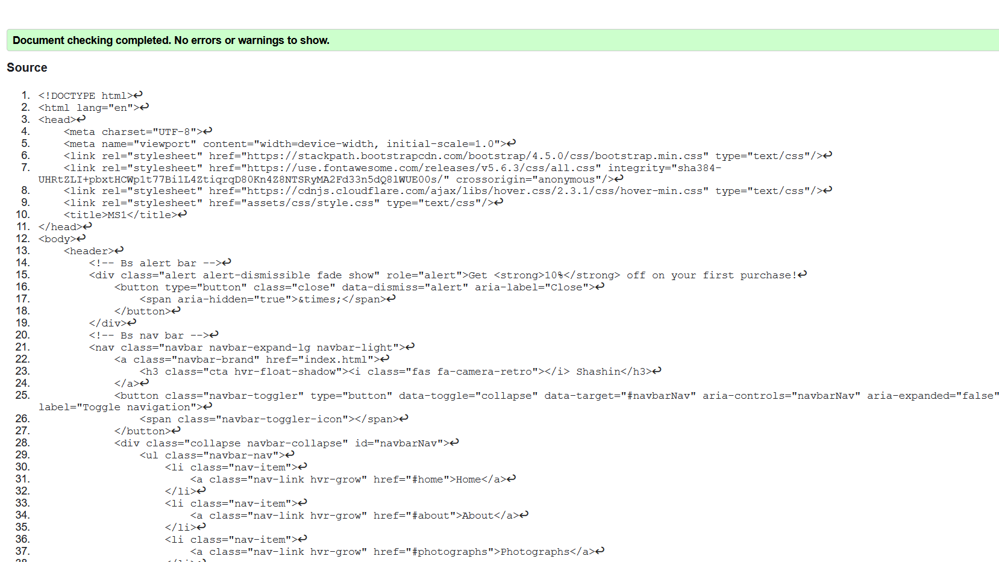
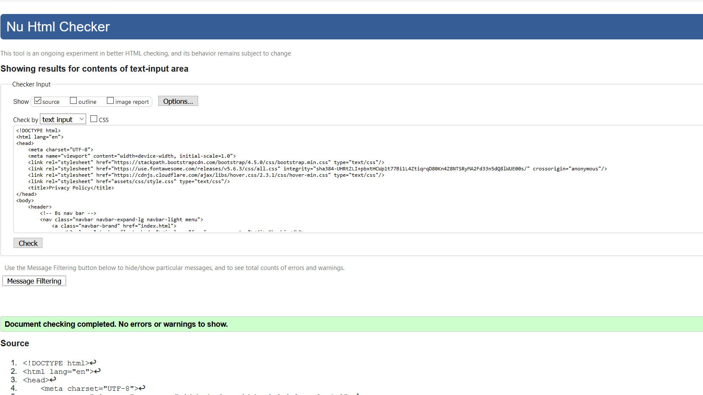
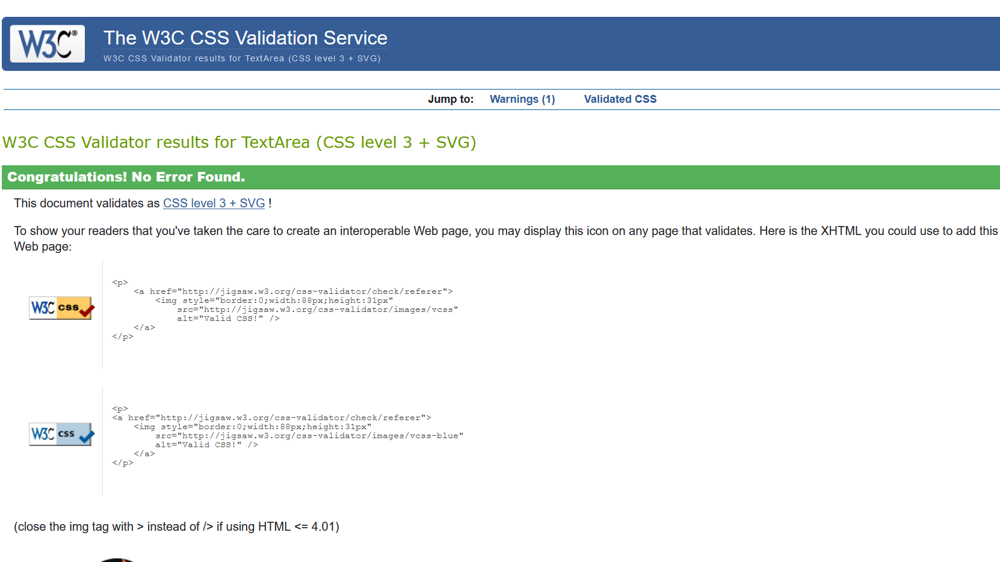
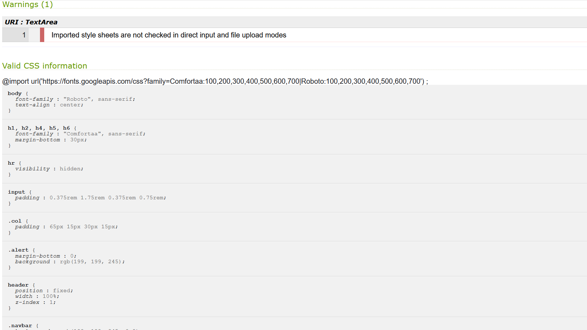
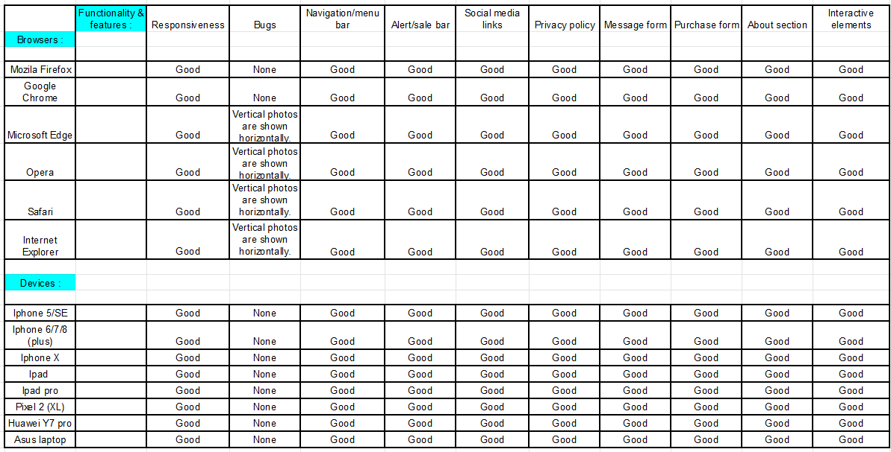

# Testing

The W3C Markup Validator and W3C CSS Validator Services were used to validate every page of the project to ensure there were no syntax errors in the project.

-   [W3C Markup Validator](https://validator.w3.org/#validate_by_input)
    
    - The validation of the index page:

    

    - The validation of the privacy page:

    

-   [W3C CSS Validator](https://jigsaw.w3.org/css-validator/#validate_by_input) 
    
    - The validation of the css file.

    
    

## Testing User Stories

-   #### First Time Visitor Goals

    1. As a First Time Visitor, I want to easily understand the main purpose of the site.

        1. When users enter the site, they are greeted with an easily readable navigation bar to go to any section on the page together with a removeable alertbar to inform them about discounts, which sticks to the top of the page for easy access. 
        2. The users will immediately see the hero image to give a peek of what will be up ahead. 
        3. Underneath the hero image there's an introduction text for the users to understand the main purpose and focus on the website.

    2. As a First Time Visitor, I want to be able to easily be able to navigate throughout the site to find content.

        1. The site has a one page design to make it easy for the users. At the top of the page there is a navigation bar that sticks there throughout the whole page, each link describes where they will end up on the page clearly.
        2. There's one separate page which you can go to through the link called; privacy policy which opens in a separate tab. That page has also his own fixed navigation bar to easily return to the main page.

    3. As a First Time Visitor, I want to know more about the person behind the project (photograph's) so that I know the origin and if it's trustworthy.
        
        1. When the users go to the about me section by scrolling down or using the link in the navbar the users can get more information about the creater and what is used to make the content. 
        2. The users could go to the contact section to get direct information by leaving me a message or sending me an email described underneath the message form.
        3. The users could also go to the bottom of the page to find social media links both in the contact section and footer.

    4. As a First Time Visitor, I want to be able to see the content of the photograph section on a bigger scale. 
    
        1. By having the photos slightly change when you hover over them it makes it clear to the users that they are clickable.
        2. When the users click on the photos the photo opens in a separate page filling up the whole screen.

-   #### Returning Visitor Goals

    1. As a Returning Visitor, I want to find more photographs and potentially purchase something.

        1. Updates on products and new content will be mentioned in the introduction section. 
        2. In the purchase section the users can select and buy products by filling in the form.
        3. More content can also be found by checking out the social media links.

    2. As a Returning Visitor, I want to find the best way to get in to contact so I could ask questions and get more information.

        1. The users can easily go the contact section by using the contact link in the navbar.
        2. Here they can fill out the form to send a direct message or they can send me an email stated underneath the form.
        3. Next to the form the users can also see a preview of my instagram account which they can click on aswell, it will open a separate page and show the post.
        4. The footer contains social media links leading to my own accounts on facebook instagram and more.
        5. Whichever link they click, it will be open up in a new tab to ensure the user can easily get back to the website.

-   #### Frequent User Goals

    1. As a Frequent User, I want to check to see if there are any newly added photos or products.

        1. In the introduction section there will be updates on new photos, options and more.

    2. As a Frequent User, I want to know what happens with the information I grant this website and if it is safe.

        1. The users can read the full privacy policy at the purchase section, which they have to agree with to continue.

    3. As a Frequent User, I want to know if there's anything new and if there are any discounts.

        1. The introduction page will hold the updates and new items.
        2. The alertbar at the top of the page will inform the users on current discounts.

## Further Testing

-   The Website was tested on multiple browsers and a variety of devices;
    
-   A large amount of testing was done on responsiveness and functionality.